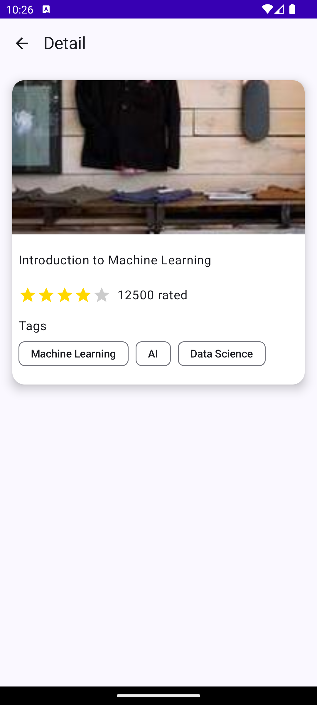

# Android Practice Core

## Overview
This is a simple Android application showcasing modern Android development best practices, including MVVM architecture, dependency injection with Hilt, Jetpack Compose for UI, and unit testing. It also integrates Room for local data storage and Retrofit/OKHttp for network requests.

## Features
- **MVVM (Model-View-ViewModel)** architecture to separate concerns and improve testability.
- **Room** for local data persistence.
- **Hilt** for dependency injection, simplifying dependency management.
- **Jetpack Compose** for modern, declarative UI design.
- **Retrofit and OKHttp** for networking and making API calls.
- **JUnit 5 and MockK** for unit testing, ensuring app reliability and functionality.

## Tech Stack

- **Architecture**: MVVM (Model-View-ViewModel)
- **Database**: Room
- **Dependency Injection**: Hilt
- **UI**: Jetpack Compose
- **Networking**: Retrofit & OKHttp
- **Unit Testing**: JUnit 5, MockK

# Recommended order of implementation

## Data

### 1. Network - API
- Network API interface
- Json models

### 2. Network - OKHttp & Retrofit
- Network Module


## UI
- View Model
- UI

## More Info

### 1. Network links
- Base url
```
http://demo6087393.mockable.io/
```
- List of courses
```
course_list
```

### 2. Sample Json
```json
{
  "id": 1,
  "title": "Introduction to Machine Learning",
  "category": "Data Science",
  "img": "https://picsum.photos/200/300",
  "instructor": "Andrew Ng",
  "rating": 4.8,
  "numRatings": 12500,
  "enrollment": 150000,
  "duration": 12,
  "tags": ["Machine Learning", "AI", "Data Science"]
}
```

### 3. Designs
#### Home


#### Detail



## License

This project is licensed under the MIT License - see the [LICENSE](LICENSE) file for details.
